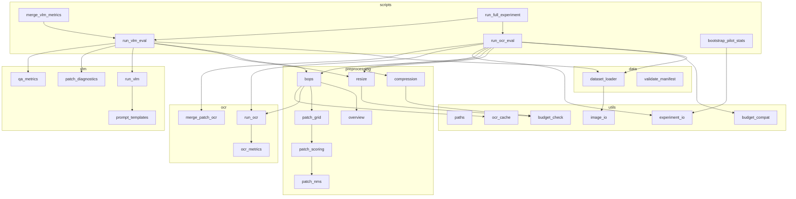

# BOPS — Architectural & Logic Reference

Single source of truth for **how the system is designed**, **why decisions were made**, and **how data flows** through the pipeline. For experiment numbers see [RESULTS.md](RESULTS.md). For setup commands see [README.md](README.md).

---

## 1. Problem & research goal

**Problem:** Text-rich document images (scans, photos, slides) exceed the visual budget that downstream models (OCR, VLMs) can process at full resolution.

**Goal:** Compare preprocessing strategies **under equal declared budgets** and measure whether **BOPS** (Budget-Aware OCR-Guided Overview-Plus-Patch Selection) preserves more useful text signal than naive resize or compression.

**Two evaluation tracks:**

| Track | Dataset | Task | Downstream | Metrics |
|-------|---------|------|------------|---------|
| OCR | TextOCR | Read all text | EasyOCR (GPU when available) | CER, WER, word recall v1 |
| VLM QA | DocVQA | Answer questions | Qwen2.5-VL-3B (4-bit) | Exact Match, ANLS |

**Core invariants:**

1. Every method declares a budget (pixels, bytes, or patch count).
2. Rows with `not_applicable=true` are skipped (method × budget mismatch).
3. Rows with `invalid_budget=true` are excluded from aggregates.
4. Paper tables use `experiment_stage ∈ {pilot, paper}` and `dry_run=false`.

---

## 2. High-level architecture

```
┌─────────────────────────────────────────────────────────────────────────────┐
│                         scripts/ (CLI entry points)                          │
│  audit_datasets · run_preprocessing · run_ocr_eval · run_vlm_eval           │
│  merge_vlm_metrics · bootstrap_pilot_stats · run_full_experiment            │
│  make_paper_assets · generate_plots · analyze_failures                      │
└───────────────────────────────────┬─────────────────────────────────────────┘
                                    │
        ┌───────────────────────────┼───────────────────────────┐
        ▼                           ▼                           ▼
┌───────────────┐           ┌───────────────┐           ┌───────────────┐
│  src/data/    │           │ src/preproc/  │           │ src/ocr/ vlm/ │
│  manifests    │           │ baselines     │           │ inference     │
│  validation   │           │ BOPS          │           │ metrics       │
└───────┬───────┘           └───────┬───────┘           └───────┬───────┘
        │                           │                           │
        └───────────────────────────┼───────────────────────────┘
                                    ▼
                          ┌─────────────────┐
                          │  src/utils/     │
                          │  paths · budget │
                          │  budget_compat  │
                          │  experiment_io  │
                          │  ocr_cache      │
                          └────────┬────────┘
                                   ▼
                          outputs/ · paper/tables/
```

**Design principles:**

1. **Library vs scripts** — Reusable logic lives in `src/`; `scripts/` only parse args and wire I/O.
2. **Manifest-driven** — All experiments iterate JSONL manifests; no hard-coded image lists in eval code.
3. **Single metric definitions** — OCR metrics only in `ocr_metrics.py`; QA metrics only in `qa_metrics.py`.
4. **Budget as first-class metadata** — Every transform attaches budget fields plus fairness flags.
5. **Lazy model loading** — OCR backend and VLM are singletons initialized on first use.
6. **Resumable long runs** — OCR eval checkpoints every N images; VLM writes per-method CSVs.

---

## 3. Repository layout (logical)

| Path | Role |
|------|------|
| `data/manifests/*.jsonl` | Unified experiment index (one row = one sample) |
| `data/train_val_images/` | TextOCR JPEGs |
| `data/raw/docvqa_hf/images/` | DocVQA PNG exports |
| `data/raw/textocr/` | Converted TextOCR JSON + index files |
| `configs/*.yaml` | Smoke tests and experiment parameters |
| `outputs/metrics/*.csv` | Per-run metric tables |
| `outputs/checkpoints/` | OCR eval resume state (deleted on success) |
| `outputs/cache/ocr/` | Cached OCR boxes + patch text (atomic writes) |
| `outputs/ocr_results/` | Transformed images from OCR eval |
| `outputs/plots/` | Generated figures |
| `outputs/audit/` | Dataset integrity reports |
| `outputs/failure_cases/` | VLM failure analysis |
| `paper/tables/` | Aggregated CSVs + bootstrap CIs |
| `src/utils/paths.py` | All path resolution (`data/` vs `Data/` on Windows) |

**Path helpers:**

- `repo_path(*parts)` → under project root
- `data_path(*parts)` → `data/` with fallback to `Data/`
- `outputs_path(*parts)` → `outputs/` (creates parent dirs)

---

## 4. Manifest schema (unified JSONL)

Every experiment row is one JSON object per line. **Required fields** (`validate_manifest.py`):

| Field | Type | TextOCR | DocVQA |
|-------|------|---------|--------|
| `image_id` | str, unique | `textocr_{id}` | `docvqa_val_{id}` |
| `dataset` | str | `"TextOCR"` | `"DocVQA"` |
| `split` | str | `train` / `val` | `val` |
| `image_path` | str | repo-relative path to JPEG | repo-relative path to PNG |
| `ocr_gt_text` | str | concatenated GT text | `""` |
| `question` | str | `""` | DocVQA question |
| `answer` | list[str] | `[]` | acceptable answers |
| `answer_type` | str / list | optional | DocVQA type |
| `metadata` | dict | width, height, docId, … | |

**Builders:**

- `build_textocr_manifest.py` — reads `textocr_imgs_index.json` + `textocr_img_text.json`
- `build_docvqa_manifest.py` — samples from `docvqa_val_500.jsonl`
- `convert_textocr_annotations.py` — one-time `.txt` → JSON + indices (Phase 2A)

**Loader:** `iter_manifest(path)` streams rows; `load_manifest(path)` loads all.

---

## 5. Budget model (fairness enforcement)

Implemented in `src/utils/budget_check.py` and `src/utils/budget_compat.py`.

### 5.1 Method × budget compatibility

`budget_compat.py` defines which `(method, budget_token)` pairs are valid:

| Outcome | Flag | Meaning |
|---------|------|---------|
| Valid pair | `not_applicable=false` | Method uses this budget axis; row is evaluated |
| Invalid pair | `not_applicable=true` | e.g. `jpeg` + `area_0.25` — skipped, not compared |

### 5.2 Budget validity rules

| Budget type | Used by | Target | Tolerance | `invalid_budget` when |
|-------------|---------|--------|-----------|------------------------|
| **pixel** | `resize`, `original` | `area_ratio × original_pixels` | ±3% | `\|actual − target\| / target > 0.03` |
| **byte** | `jpeg`, `webp` | e.g. `kb_200` → 204,800 bytes | at-or-under | `actual_bytes > target_bytes` |
| **patch** | BOPS | exact K patches | **0%** | `actual_patches ≠ target_patches` |

**Byte extras:**

- `byte_utilization = actual_bytes / target_bytes`
- `underutilized_budget = true` when utilization < 0.70 — **reported, not excluded**

**Budget token syntax** (CLI `--budgets`):

- `area_0.5` → 50% of original pixel area
- `kb_200` → 200 KiB encoded file size
- `patches_4` → exactly 4 high-res patches (+ overview, not counted in patch budget check)

### 5.3 Aggregation filter

`experiment_io.paper_filter()` and `make_paper_assets.py` apply:

```python
df[
    (df["dry_run"] == False) &
    (df["not_applicable"] == False) &
    (df["invalid_budget"] == False) &
    (df["experiment_stage"].isin(["pilot", "paper"]))
]
```

---

## 6. Preprocessing methods

### 6.1 Baselines

| Method | Module | Mechanism | Budget axis |
|--------|--------|-----------|-------------|
| `original` | `run_ocr_eval.apply_method` | Save full-res PNG | none (reference) |
| `resize` | `resize.resize_to_area_ratio` | Uniform scale √ratio on W,H | pixel (area ratio) |
| `jpeg` | `compression.compress_image_to_file` | Binary search JPEG quality | byte |
| `webp` | same | Binary search WebP quality | byte |

**Resize math:** `scale = sqrt(area_ratio)`; new W,H = round(old × scale).

**Compression math:** Binary search quality ∈ [5, 95] until `len(bytes) ≤ target`; if impossible, use min quality.

### 6.2 BOPS (proposed method)

**Entry:** `preprocessing/bops.py` → `run_bops(image, num_patches, mode, ...)`

**Pipeline steps:**

```
Original image
    │
    ├─► [1] generate_overview()     → low-res overview (~50k pixels default)
    │
    ├─► [2] generate_grid_patches() → sliding window (256×256, stride 128)
    │
    ├─► [3] select patches by mode:
    │       • ocr_guided → score + NMS
    │       • random     → uniform sample
    │       • uniform    → evenly spaced grid indices
    │       • overview_only → K=0 patches
    │
    ├─► [4] crop_patch() × K        → high-res patch PIL images
    │
    └─► [5] check_patch_budget(K)   → metadata.invalid_budget
```

**Default hyperparameters:**

| Parameter | Default | Meaning |
|-----------|---------|---------|
| `overview_target_pixels` | 50,000 | Overview area cap |
| `patch_size` | 256 | Square patch side |
| `stride` | 128 | Grid step (50% overlap) |
| `nms iou_threshold` | 0.5 | Overlap suppression |

### 6.3 OCR-guided patch scoring

`patch_scoring.py` — weighted sum of four signals:

| Signal | Weight | Source |
|--------|--------|--------|
| `text_coverage` | 0.40 | Fraction of OCR box area inside patch |
| `text_confidence` | 0.30 | Mean OCR confidence for overlapping boxes |
| `edge_density` | 0.15 | Mean gradient magnitude in patch (grayscale) |
| `entropy` | 0.15 | Normalized histogram entropy in patch |

OCR boxes come from `run_ocr_with_boxes()` on a temp full-image PNG. Results are cached in `outputs/cache/ocr/` via `ocr_cache.py` (atomic JSON writes, int32-safe boxes).

**NMS** (`patch_nms.py`): Greedy by score; suppress candidates with IoU ≥ 0.5; stop at `top_k = K`.

---

## 7. OCR subsystem

### 7.1 Backend selection (`ocr/run_ocr.py`)

```
get_ocr():
    try PaddleOCR (lang=en, angle cls)
    except → try EasyOCR (en, gpu=CUDA available, verbose=False)
    except → RuntimeError
```

- **PaddleOCR:** May fail on Python 3.14 / missing PaddlePaddle.
- **EasyOCR:** Portable fallback; **GPU when CUDA available** (`verbose=False` on Windows).

### 7.2 APIs

| Function | Returns | Used for |
|----------|---------|----------|
| `run_ocr_on_image(path)` | concatenated line text | OCR eval on transformed image |
| `run_ocr_with_boxes(path)` | `[{box, text, confidence}, …]` | BOPS patch scoring |

### 7.3 OCR eval flow (`scripts/run_ocr_eval.py`)

```
for each manifest row (resumable via checkpoint):
  for each method in --methods:
    for each budget in --budgets:
      if not_applicable(method, budget): append skip row; continue
      1. load_image(image_path)
      2. apply_method() → transformed path(s) + meta
      3. run_ocr_on_image() OR merge_patch_ocr() for BOPS
      4. cer(), wer(), word_recall() vs ocr_gt_text
      5. append row to ocr_metrics_{manifest}_{stage}.csv
      6. checkpoint every --checkpoint-every images
```

**BOPS OCR path:** Saves overview + per-patch images; runs OCR on each; merges text via `merge_patch_ocr.py`. Logs `total_bops_pixels` for budget accounting.

**Resumability:** Checkpoint at `outputs/checkpoints/ocr_eval_{manifest}_{stage}.json`. Auto-resumes on re-run; `--overwrite` starts fresh. CSV fallback if checkpoint file is missing.

**Terminal UX:** Banner, progress bar, per-method status lines.

### 7.4 Metrics (`ocr/ocr_metrics.py`) — canonical

**Normalization** (`normalize_text.py`): lowercase → strip punctuation → collapse whitespace.

| Metric | Definition |
|--------|------------|
| **CER** | `jiwer.cer(gt, pred)` on normalized strings |
| **WER** | `jiwer.wer(gt, pred)` on normalized strings |
| **Word recall v1** | `matched_gt_tokens / total_gt_tokens` — count-aware token match |

Do not reimplement these elsewhere.

---

## 8. VLM subsystem

### 8.1 Model (`vlm/run_vlm.py`)

| Setting | Value |
|---------|-------|
| Model | `Qwen/Qwen2.5-VL-3B-Instruct` |
| Quantization | 4-bit `BitsAndBytesConfig` |
| Device | `device_map="auto"` (CUDA) |
| Dtype | float16 |
| Image cap | longest side ≤ 768 px (`_resize_for_vlm`) |
| Max new tokens | 64 |
| Caching | Global `_model`, `_processor` singletons |

### 8.2 Prompt layout (`vlm/prompt_templates.py`)

**Single image** (`resize`, `overview_only`):
```
[image] + "Question: {q}\nAnswer:"
```

**Overview + patches** (`bops`, `random`, `uniform`):
```
[overview, patch_1, patch_2, …] + multi-image instruction + question
```

Image order in the tensor **must** match prompt semantics: overview first, then patches.

### 8.3 Answer parsing (`vlm/parse_answers.py`)

Strips chat artifacts:
1. Text after last `assistant` marker (case-insensitive)
2. Text after `Answer:` / `answer:`
3. Whitespace normalization

### 8.4 VLM eval flow (`scripts/run_vlm_eval.py`)

| `--method` | Preprocessing | VLM call |
|------------|---------------|----------|
| `resize` | `resize_to_area_ratio(0.25)` | `run_vlm_single(resized, q)` |
| `overview_only` | `run_bops(K=0, overview_only)` | `run_vlm_single(overview, q)` |
| `random` | `run_bops(K, random)` | `run_vlm_overview_patches(overview, patches, q)` |
| `uniform` | `run_bops(K, uniform)` | same |
| `bops` | `run_bops(K, ocr_guided)` | same |

**Output:** Per-method CSV `vlm_metrics_{manifest}_{method}_{suffix}.csv` — no overwrite across methods.

**Post-hoc diagnostics** (`vlm/patch_diagnostics.py`): For BOPS rows, checks whether GT answer text appears in full-image OCR vs selected-patch OCR. **Never used in patch selection** — analysis only.

**`--dry-run`:** Skips model load; `prediction = "dry-run"`.

### 8.5 QA metrics (`vlm/qa_metrics.py`)

| Metric | Definition |
|--------|------------|
| **Exact Match** | 1.0 if normalized pred equals any normalized reference answer |
| **ANLS** | Best over references: `1 − lev_dist/max_len` if ratio < 0.5 threshold else 0 |

---

## 9. Experiment orchestration

### 9.1 Experiment stages

| Stage | Typical scale | In paper tables? |
|-------|---------------|------------------|
| `debug` | 5–20 samples | No |
| `sanity` | 10 samples | No |
| `pilot` | OCR n=200, VLM n=100 | **Yes** |
| `paper` | Full manifests | **Yes** (not run yet) |

### 9.2 Phase gates (`run_full_experiment.py`)

| Phase | OCR | VLM | Notes |
|-------|-----|-----|-------|
| `debug` | 5 samples, 2 methods | 2 samples | Smoke |
| `pilot` | 20 samples, 5 methods × 3 budgets | — | Quick curves |
| `ablation` | BOPS × 3 repeats | patch K ∈ {0,2,4,8,12} | |
| `paper` | 50 samples, full budget grid | 5 methods × 10 samples | + failure analysis |

**`--dry-run` / `--real`:** Orchestrator passes `--dry-run` by default; use `--real` for inference.

### 9.3 Downstream analysis

```
ocr_metrics_*.csv / vlm_metrics_merged.csv
        │
        ├─► merge_vlm_metrics.py     → vlm_metrics_merged.csv
        ├─► make_paper_assets.py     → paper/tables/table_*.csv
        ├─► generate_plots.py        → outputs/plots/cer_vs_budget.png
        ├─► bootstrap_pilot_stats.py → paper/tables/bootstrap_ci.csv
        └─► analyze_failures.py      → outputs/failure_cases/
```

### 9.4 Statistical tests (`metrics/statistical_tests.py`)

`bootstrap_ci(diffs, n_boot=1000)` — paired difference confidence intervals.

`scripts/bootstrap_pilot_stats.py` compares:
- OCR: BOPS `patches_8` vs resize `area_0.25`, vs original
- VLM: BOPS vs random, uniform, overview_only (ANLS)

---

## 10. Data acquisition logic

### TextOCR

1. Source: `TextOCR_0.1_train.txt` (~280 MB JSON misnamed as `.txt`)
2. `convert_textocr_annotations.py` → `TextOCR_0.1_train.json` + indices
3. Images: `data/train_val_images/train_images/{id}.jpg`
4. `audit_datasets.py` — gate: ≤1% missing, sample checks pass

### DocVQA

1. `download_docvqa_hf.py` — **streaming** `validation[:500]` (avoids full ~9.5 GB download)
2. Exports PNGs + `docvqa_val_500.jsonl`
3. Subsets: `docvqa_debug` (20), `docvqa_pilot` (100)

---

## 11. Config YAML pattern

Example `configs/smoke_test.yaml`:

```yaml
input_image: data/raw/docvqa_hf/images/docvqa_val_49153.png
output_dir: transformed_images
metadata_csv: metrics/smoke_test_metadata.csv
area_ratio: 0.5
```

`run_preprocessing.py` loads YAML via `config.py`, resizes one image, writes metadata CSV — validates paths and I/O without full experiment cost.

---

## 12. Module dependency graph



---

## 13. Key design decisions & tradeoffs

| Decision | Rationale | Tradeoff |
|----------|-----------|----------|
| Overview + K patches (not K full frames) | Separates global layout from local text | VLM must handle multi-image input; VRAM scales with K |
| OCR guides patch **selection**, not VLM text | Selection is cheap; VLM reads selected regions | OCR errors can mis-rank patches (pilot: answer in selected patches ~6%) |
| BOPS OCR uses `merge_patch_ocr` | Tests full patch-merge pipeline | Slower than overview-only OCR |
| `not_applicable` vs `invalid_budget` | Clean method×budget matrix; no empty cross-combos | More rows in raw CSV (skipped in aggregates) |
| Byte budget: valid if `actual ≤ target` | Under-budget compression is fair | `kb_500` often underutilized (~35–40%) |
| Exact patch budget (0% tolerance) | Prevents unfair patch-count drift | Grid edge cases may yield fewer valid candidates |
| Word recall v1 (not F1) | Matches proposal; count-aware token match | May differ from standard IR recall |
| Qwen2.5-VL-3B 4-bit | Fits 4–8 GB consumer GPUs | Slower / lower quality than full precision |
| Per-method VLM CSVs + merge | Prevents overwrite during multi-method runs | Extra merge step |
| OCR checkpoints every 20 images | n=200 runs survive interruption | Checkpoint file deleted on successful completion |
| JSONL manifests | Streamable, git-friendly metadata | No schema enforcement beyond `validate_manifest` |
| `data/` vs `Data/` fallback | Windows case-insensitivity | Two possible paths; always use `data_path()` |

---

## 14. Known gaps & extension points

| Gap | Where to fix |
|-----|--------------|
| VLM patch selection misses answer 94% of time | `patch_scoring.py` — improve scoring signals or add question-aware reranking |
| Paper-scale manifests (500–1000) | `build_*_manifest.py --limit` |
| Holm / McNemar not wired | `statistical_tests.py` + new script |
| Seam carving (optional Phase 12) | Not implemented — proposal only |
| `run_full_experiment.py` defaults to dry-run | Use `--real` explicitly for inference |

---

## 15. File → responsibility quick index

| File | Responsibility |
|------|----------------|
| `src/preprocessing/bops.py` | Full BOPS pipeline orchestration |
| `src/preprocessing/patch_scoring.py` | OCR-guided patch importance |
| `src/preprocessing/patch_nms.py` | Overlap suppression |
| `src/preprocessing/patch_grid.py` | `Patch` dataclass, grid, crop |
| `src/preprocessing/overview.py` | Low-res global image |
| `src/preprocessing/resize.py` | Area-ratio baseline |
| `src/preprocessing/compression.py` | JPEG/WebP byte baseline |
| `src/utils/budget_check.py` | Budget fairness (pixel, byte, patch) |
| `src/utils/budget_compat.py` | Method × budget applicability matrix |
| `src/utils/experiment_io.py` | Run IDs, CSV paths, paper filter, OCR checkpoints |
| `src/utils/ocr_cache.py` | Cached OCR boxes (atomic JSON) |
| `src/utils/paths.py` | Filesystem layout |
| `src/utils/image_io.py` | `load_image`, `write_metadata_csv` |
| `src/ocr/run_ocr.py` | OCR backends |
| `src/ocr/merge_patch_ocr.py` | Merge overview + patch OCR text |
| `src/ocr/ocr_metrics.py` | CER, WER, word recall v1 |
| `src/vlm/run_vlm.py` | Qwen load + generate |
| `src/vlm/patch_diagnostics.py` | Post-hoc answer-in-patch analysis |
| `src/vlm/qa_metrics.py` | EM, ANLS |
| `src/data/validate_manifest.py` | Manifest gate |
| `src/data/dataset_loader.py` | JSONL iteration |
| `src/metrics/budget_metrics.py` | Valid-budget aggregation |
| `src/metrics/statistical_tests.py` | Bootstrap CI |
| `src/visualization/plot_budget_curves.py` | CER vs budget plot |
| `scripts/run_ocr_eval.py` | OCR experiment loop (resumable) |
| `scripts/run_vlm_eval.py` | VLM experiment loop (per-method CSV) |
| `scripts/merge_vlm_metrics.py` | Combine VLM CSVs |
| `scripts/bootstrap_pilot_stats.py` | Paired bootstrap CIs |
| `scripts/run_full_experiment.py` | Phase orchestration |
| `scripts/audit_datasets.py` | Phase 2A gate |
| `scripts/make_paper_assets.py` | Table aggregation |

---

## 16. Mental model (one paragraph)

A **manifest row** points to an image and ground truth. **Preprocessing** transforms the image under a **declared budget** and records whether the budget was met and whether the method×budget pair applies. For **OCR**, transformed images (or BOPS overview+patches merged via `merge_patch_ocr`) are read by EasyOCR and scored against `ocr_gt_text`. For **VLM**, the image becomes either one downscaled frame or a **BOPS bundle** (overview + K patches), fed to Qwen with a fixed prompt template, and scored against DocVQA answer lists. **Aggregates and plots** exclude `not_applicable`, `invalid_budget`, and `dry_run` rows; paper tables require `experiment_stage ∈ {pilot, paper}`. **Pilot findings:** BOPS `patches_8` significantly beats resize at low budget on OCR word recall, but VLM patch selection frequently misses answer regions — do not claim VLM wins until selection improves.
