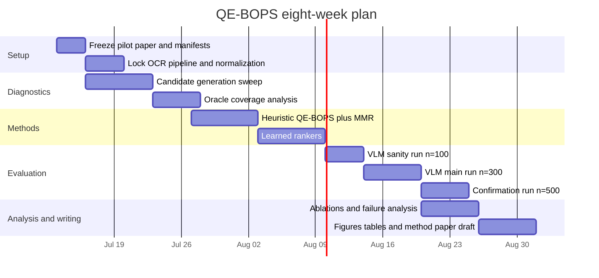

# QE-BOPS Experimental Roadmap for Turning BOPS into a Strong Method Paper

## Executive summary

Your pilot paper already isolates the core failure mode that a stronger paper should solve. In the current study, BOPS improves OCR word recall on TextOCR relative to aggressive resizing, but it does not translate that OCR gain into strong DocVQA outcomes; selected-patch OCR contains the answer in only a small fraction of cases, while full-image OCR contains it much more often. In the same pilot, Q-BOPS improves ANLS only modestly over BOPS, which means lexical question matching is not enough. That makes the next paper a **question-conditioned evidence-selection paper**, not another OCR-preservation paper. fileciteturn0file0 fileciteturn0file1

The strongest next paper is therefore **QE-BOPS: Question-Conditioned Evidence-Aware Patch Selection for Budgeted Document VQA**. The central claim should be narrow and defensible: **under a fixed patch budget, question-conditioned evidence-aware ranking selects answer-bearing regions more reliably than OCR-density patching, improving DocVQA over random, uniform, BOPS, and Q-BOPS baselines.** This framing is well aligned with the broader document-AI literature, where strong models explicitly leverage **text, layout, and image** jointly, and with modern high-resolution VLM work, which treats native-resolution and variable-resolution processing as central rather than incidental. citeturn0academia0turn10academia0turn0academia2turn11academia0turn1academia1turn1academia2turn1academia0turn10academia1

The immediate sequence of experiments should be: first, freeze a deterministic candidate generator and OCR pipeline; second, measure **oracle answer coverage** on DocVQA for \(K=1,2,4,8\); third, implement a **heuristic QE-BOPS** with question relevance, answer-type, label-value proximity, layout, OCR confidence, and entropy plus MMR diversity; fourth, train simple learned rankers such as logistic regression, LightGBM, and a small MLP; and only then run large VLM evaluations at \(n=100 \rightarrow 300 \rightarrow 500\). TextOCR should remain in the paper, but only as a **secondary OCR sanity track** for the shared overview-plus-patch representation and OCR merge procedure, because QE-BOPS itself is question-conditioned and therefore fundamentally a DocVQA method. citeturn12view0turn0academia1turn6academia3

The main decision gate is simple: **do not spend large VLM budget until answer_coverage@K clearly improves**. If heuristic QE-BOPS cannot at least double BOPS selected-patch answer coverage at \(K=2\), or if oracle coverage itself is low, the bottleneck is still upstream in candidate generation or OCR, not in the VLM. That gate is the single most important discipline for converting the pilot into a publishable method paper. fileciteturn0file0 fileciteturn0file1

## Problem framing and dataset roles

The current pilot should be reframed around a stronger scientific question: **how can a patch selector preserve question-specific evidence, not just text-rich regions?** That pivot is well motivated by the structure of the target task. The DocVQA dataset defines a single-document VQA task in which answers are **single spans of text extracted from the document image**, and the dataset contains about **50K questions and 12K images**. By contrast, TextOCR was created to isolate OCR over real images with arbitrary-shaped scene text and provides roughly **900K annotated words**. In other words, DocVQA is the right place to test evidence selection, while TextOCR is the right place to keep an eye on whether the representation still preserves readable text at all. citeturn12view0turn6academia3turn0academia1

That division of labor also matches the cited model literature. LayoutLMv2, LayoutLMv3, TILT, and UDOP emphasize that document understanding depends on combining **text, layout, and image** and on learning alignment between words and patches. Pix2Struct shows that variable-resolution representations and question-conditioned visual-language processing can be powerful across document-like inputs. Donut, as an OCR-free counterpoint, underscores that OCR itself is not the task; the task is extracting the right answer from document evidence. LLaVA-UHD, NaViT, and Qwen2.5-VL reinforce the practical point that high-resolution inputs and variable-resolution handling matter when fine-grained visual detail is important. citeturn10academia0turn0academia2turn11academia0turn0academia0turn1academia1turn0academia3turn1academia0turn1academia2turn10academia1

Your own pilot already places a useful bound on the problem. BOPS used a 256×256 patch grid and scored patches using OCR text coverage, OCR confidence, edge density, and entropy; the question-aware variant added lexical overlap and string similarity. Yet the paper also shows that the decisive failure comes from **evidence selection**, not from the mere presence of readable OCR somewhere on the page. That observation should become the foundational motivation for QE-BOPS. fileciteturn0file0 fileciteturn0file1

The first methodological gap to fix is **candidate-generation specificity**. The pilot paper makes the patch size visible, but stride and overlap policy are not clearly specified in the main text, so the QE-BOPS paper should lock them down explicitly. I recommend a deterministic multi-scale candidate pool:

| Component | Recommended default | Alternative | Why |
|---|---:|---:|---|
| Overview image | long side 1024 px | 896 px | preserves global layout for VLM context |
| Square candidates | 256 px, stride 128 | stride 192 | better local evidence recall |
| Larger candidates | 384 px, stride 192 | none | catches wide fields and value regions |
| Optional strips | 256×512 and 512×256, 50% overlap | omit on first pass | useful for rows, headers, tables |
| Edge anchoring | on | off | ensures borders and bottom rows are covered |
| NMS IoU threshold | 0.30 | 0.50 | removes near-duplicates without collapsing diversity |

This design keeps candidate count in a tractable range while respecting what NaViT, Pix2Struct, and LLaVA-UHD collectively suggest: variable-resolution or native-resolution handling matters most when small localized evidence is otherwise lost by resizing. citeturn1academia2turn1academia1turn1academia0

TextOCR should then be used to evaluate only the **shared infrastructure**: OCR merge quality, duplicate suppression, candidate pool coverage, and whether the new candidate generator degrades OCR quality relative to the pilot BOPS representation. QE-BOPS proper should be judged primarily on DocVQA, because TextOCR does not supply the question signal that the new method is meant to exploit. citeturn0academia1turn12view0

## QE-BOPS method design

### OCR pipeline and normalization

For the method paper, the OCR stack must be frozen early. Since your assumed resources are a single GPU plus either Tesseract or Google OCR, the most reproducible approach is to choose **one main OCR engine** for all headline experiments and use the other only for a robustness appendix. If API cost is a concern, use Tesseract as the main engine. If textual fidelity is the priority and cost is acceptable, Google OCR is a reasonable main engine. The specific OCR choice is **unspecified** by the current sources, so whichever engine you select must stay fixed across all comparisons.

The pipeline should explicitly cache:

1. full-page OCR,
2. candidate-patch OCR,
3. merged selected-patch OCR,
4. confidence statistics,
5. a normalized text form used for answer matching.

Normalization should include Unicode NFKC, lowercasing, whitespace collapse, and punctuation normalization. For answer matching, use both exact normalized string match and ANLS-like fuzzy matching, because DocVQA evaluation is generative/extractive enough that orthographic near-matches matter, and ANLS-style evaluation is standard in the DocVQA ecosystem and compatible with later ANLS* style reporting if needed. citeturn6academia0turn6academia2turn12view0

### Feature engineering

QE-BOPS should be built around six feature families, with each family tied to the document-AI literature rather than treated as ad hoc engineering. LayoutLMv2, LayoutLMv3, TILT, and UDOP collectively support injecting layout-aware and alignment-aware signals; Pix2Struct supports question-conditioned processing on variable-resolution visual inputs. citeturn10academia0turn0academia2turn11academia0turn0academia0turn1academia1

The recommended patch feature set is:

| Family | Recommended features |
|---|---|
| Question relevance | BM25(question, patch OCR), token overlap ratio, char 3-gram Jaccard, optional MiniLM cosine similarity |
| Answer-type prior | date regex, currency regex, percentage, integer/decimal, email, phone, address-like, name-like capitalization patterns, yes/no prior |
| Label-value proximity | distance to question-matching OCR boxes, same row score, same column score, right-of-label score, below-label score, “:” separator proximity |
| Layout | normalized x/y center, patch width/height, header/body/footer zone, line density, box density, table/grid likelihood |
| OCR quality | mean OCR confidence, min confidence, low-confidence fraction, number of OCR tokens, average token length |
| Visual statistics | entropy, edge density, local contrast, blank-space ratio |

The most important new family is **label-value proximity**. In document QA, answers are frequently near a question-relevant label rather than inside the densest text region. If the question is “What is the invoice date?”, then a patch containing “Invoice Date” plus an adjacent date should score far above a dense paragraph patch with more tokens but no value field. This is exactly the structural intuition that general document models exploit via text-layout-image interaction. citeturn10academia0turn0academia2turn11academia0turn0academia0

### Heuristic QE-BOPS and MMR diversity

Before training any model, implement a strong heuristic selector. A workable default is:

\[
s_h(p)=0.10C_{\text{text}}+0.10C_{\text{conf}}+0.05E+0.05H+0.20R_{\text{lex}}+0.10R_{\text{sem}}+0.15A_{\text{type}}+0.20P_{\text{label-value}}+0.05L_{\text{layout}}
\]

where \(R_{\text{lex}}\) is BM25 and overlap-based question relevance, \(R_{\text{sem}}\) is optional embedding similarity, \(A_{\text{type}}\) is answer-type compatibility, and \(P_{\text{label-value}}\) is the structural proximity score.

Selection should then use MMR-style diversity rather than score-only top-\(K\):

\[
\text{MMR}(p)=\lambda \hat s_h(p) - (1-\lambda)\max_{q\in S} \text{IoU}(p,q)
\]

with \(\lambda=0.75\) as the default, and \(\text{IoU}\) computed over patch rectangles. This should outperform plain NMS when several neighboring high-score patches correspond to the same title block or text cluster.

The first headline experiment for this branch should not be ANLS. It should be **answer_coverage@K** on DocVQA OCR. If the heuristic cannot substantially increase answer-bearing patch coverage, a learned ranker will probably not save the paper.

### Learned rankers

The learned branch should be intentionally simple and interpretable. The training signal is weak supervision derived from DocVQA answers and OCR. Because DocVQA answers are text spans, the most practical label is:

- **positive** if the normalized ground-truth answer appears in the patch OCR,
- **soft positive** if ANLS-like similarity is high or if a large fraction of answer tokens is present,
- **negative** otherwise. citeturn12view0turn6academia2

Recommended model baselines and hyperparameters are:

| Model | Objective | Recommended defaults |
|---|---|---|
| Logistic regression | binary patch relevance | `C=1.0`, `class_weight=balanced`, L2 |
| LightGBM | binary or lambdarank by question group | `n_estimators=300`, `num_leaves=31`, `learning_rate=0.05`, `min_data_in_leaf=20`, `feature_fraction=0.8`, `bagging_fraction=0.8`, `bagging_freq=1` |
| Small MLP | binary relevance | 2 hidden layers `64 -> 32`, ReLU, dropout `0.1`, batch `256`, lr `1e-3`, early stopping patience `3`, max `20` epochs |

Use the heuristic QE-BOPS score itself as one of the input features. That often makes logistic regression and LightGBM surprisingly competitive and yields more interpretable feature-importance plots. If LightGBM does not beat the heuristic on validation, keep the heuristic as the main method and present the learned models as informative but non-essential ablations.

## Evaluation program

### Oracle coverage and training labels

Oracle analysis is the most important missing experiment. It tells you whether the problem is solvable at a given patch budget. For each DocVQA sample, compute OCR on the full page and on every candidate patch, then label whether the answer appears in each patch OCR. Use those labels to compute:

- `oracle_answer_coverage@1`
- `oracle_answer_coverage@2`
- `oracle_answer_coverage@4`
- `oracle_answer_coverage@8`

Because DocVQA answers are single text spans, patch-level positive labels are well aligned with the task definition. However, some multi-token answers may straddle patch boundaries, so for oracle@K with \(K>1\), also compute a **union-of-patches** version where the merged OCR text of the oracle-selected set is allowed to satisfy coverage. citeturn12view0

The coverage gate should be:

- if `oracle@2` is still very low, revisit candidate generation before any ranking work;
- if `oracle@4` rises sharply while `oracle@2` remains weak, main VLM experiments should use \(K=4\);
- if oracle is high but BOPS and Q-BOPS remain low, the method paper has clear headroom.

### Metrics and VLM protocol

Your main evaluation metrics should be:

| Metric | Use |
|---|---|
| `answer_coverage@K` | primary evidence-selection metric |
| `oracle_answer_coverage@K` | upper bound and headroom analysis |
| `ANLS` | primary DocVQA task metric |
| `EM` | exact answer metric |
| runtime per sample | practical deployment metric |
| number of images sent to VLM | fairness/accounting |
| median selected pixels | budget accounting |
| TextOCR word recall / precision / F1 | auxiliary OCR sanity metrics |

ANLS should remain the main task metric because it is standard in DocVQA reporting, while EM gives a harsher complementary view. Paired bootstrap confidence intervals, as in your pilot, should remain the default inferential tool. citeturn6academia0turn6academia2

The VLM protocol should be staged:

| Stage | Size | Purpose | Required gate |
|---|---:|---|---|
| sanity | `n=100` | debug prompts, ranking, OCR matching | oracle headroom present and heuristic coverage improved |
| main | `n=300` | headline comparison and CIs | heuristic or learned QE-BOPS beats BOPS/Q-BOPS on coverage |
| confirmation | `n=500` | stabilize headline numbers | ANLS trend persists at `n=300` |

Keep the prompt fixed across methods, as in the pilot, and keep image ordering deterministic. My recommendation is: **overview first, then selected patches in reading order** rather than selection-score order. That gives the VLM global context followed by human-like spatial sequencing. The current paper reports that VLM runtime is already much higher for patch methods than for resized full images, so uncontrolled large-\(K\) experiments will be expensive on a single GPU. fileciteturn0file0 fileciteturn0file1

### Experiments, deliverables, and success criteria

| Experiment | Expected deliverables | Success criteria |
|---|---|---|
| Candidate generator sweep | `candidate_pool_stats.csv`, `candidate_examples.pdf` | oracle@4 clearly exceeds current BOPS coverage; no large blind spots |
| OCR pipeline freeze | OCR JSON cache, normalization spec, merge unit tests | deterministic reruns; stable answer matching |
| Oracle coverage analysis | `oracle_coverage_by_k.csv`, oracle-vs-selected plot | strong headroom at `K=2` or `K=4` |
| Heuristic QE-BOPS | `qe_bops_heuristic_scores.parquet`, coverage table | at least 2× BOPS selected-patch answer coverage at `K=2`, or strong gain at `K=4` |
| Learned rankers | checkpoints, feature importances, calibration plots | best learned model beats heuristic on validation |
| VLM main benchmark | prediction JSONL, `anls_em_results.csv`, paired bootstrap CI table | QE-BOPS beats random, uniform, BOPS, Q-BOPS at fixed `K` |
| TextOCR auxiliary check | OCR recall/precision/F1 table | no catastrophic OCR collapse relative to shared overview+patch representation |
| Ablations and failures | ablation table, qualitative panel, error taxonomy | clear mechanism story: question relevance + label-value + layout matter |

### Ablations, failures, and figures

The necessary ablations are: remove question relevance, remove answer-type prior, remove label-value proximity, remove layout, remove OCR-confidence features, remove entropy, remove MMR, single-scale versus multi-scale candidates, and heuristic versus learned scoring. The most important one is **removing label-value proximity**; if performance drops materially, you have strong evidence that the method works for the right reason.

The failure taxonomy should separate at least six cases: answer absent from OCR entirely; answer present in candidate pool but not selected; answer split across patches; label selected without value; value selected without label; VLM failure despite answer-bearing patch being selected. That taxonomy will make the method paper much stronger even if absolute ANLS remains well below resized full-image baselines.

Suggested figures and tables are:

- oracle vs selected answer coverage plot,
- coverage-by-\(K\) table for \(K=1,2,4,8\),
- ANLS/EM bar charts for all baselines,
- runtime bar chart,
- feature-ablation table,
- qualitative success/failure panel with highlighted selected patches and answer OCR boxes,
- feature-importance plot for logistic regression or LightGBM,
- failure taxonomy table by percentage of validation samples.

## Execution plan, scripts, reproducibility, and risks

### Suggested scripts and outputs

| Script | Purpose | Main output |
|---|---|---|
| `scripts/build_docvqa_manifests.py` | fixed `n=100/300/500` manifests | `manifests/docvqa_{100,300,500}.jsonl` |
| `scripts/run_fullpage_ocr.py` | page-level OCR cache | `outputs/ocr/fullpage/*.json` |
| `scripts/generate_candidate_patches.py` | deterministic multi-scale candidate pool | `outputs/candidates/candidates.parquet` |
| `scripts/run_patch_ocr.py` | candidate OCR cache | `outputs/ocr/patches/*.json` |
| `scripts/label_patches_from_answers.py` | weak labels from answer matching | `outputs/labels/patch_labels.parquet` |
| `scripts/eval_oracle_coverage.py` | oracle@K and headroom | `tables/oracle_coverage.csv`, `figs/oracle_vs_selected.pdf` |
| `scripts/run_qe_bops_heuristic.py` | heuristic selection + MMR | `outputs/selections/qe_bops_heuristic_k*.jsonl` |
| `scripts/train_logreg_ranker.py` | logistic baseline | `checkpoints/logreg.pkl` |
| `scripts/train_lgbm_ranker.py` | LightGBM baseline | `checkpoints/lgbm.txt` |
| `scripts/train_mlp_ranker.py` | small MLP baseline | `checkpoints/mlp.pt` |
| `scripts/eval_patch_coverage.py` | answer_coverage@K | `tables/coverage_by_method.csv` |
| `scripts/run_vlm_docvqa.py` | VLM inference | `outputs/vlm_predictions/*.jsonl` |
| `scripts/eval_docvqa_metrics.py` | ANLS, EM, paired bootstrap | `tables/anls_em_ci.csv` |
| `scripts/run_textocr_aux.py` | auxiliary OCR-only sanity track | `tables/textocr_aux_metrics.csv` |
| `scripts/make_qualitative_figures.py` | paper figures | `figs/qual_examples.pdf` |
| `scripts/make_tables.py` | paper-ready tables | `paper/tables/*.tex` or `*.md` |

### Compute and data needs

The dominant cost is not ranker training; it is OCR precomputation and especially VLM inference. Logistic regression and LightGBM will train quickly on CPU. A small MLP is still cheap. The main practical expense is the VLM pass over multi-image inputs, which your pilot already showed can be much slower than a resized single-image baseline. That is why the coverage gate is non-negotiable. fileciteturn0file0 fileciteturn0file1

A practical single-machine plan is:

| Resource | Recommendation |
|---|---|
| GPU | single consumer GPU is sufficient for ranker work and staged VLM runs |
| CPU/RAM | 8–16 CPU threads and 16–32 GB RAM recommended for OCR caching and feature extraction |
| Storage | estimated 30–50 GB working space for raw images, OCR JSON, candidate crops, features, predictions; exact requirement unspecified |
| OCR cost | local Tesseract cost is negligible; Google OCR API cost is external and unspecified |
| Wall-clock | plan OCR as a separate cached stage; plan VLM runs overnight once coverage gates are passed |

### Reproducibility checklist

Use manifest-driven evaluation at every stage. Fix all seeds. Version the OCR engine, question prompt, candidate generation parameters, and normalization rules. Store raw OCR JSON, not only merged text. Save candidate coordinates and selected-patch indices for every method. Log wall-clock runtime both with and without OCR cache hits. Keep the `n=100`, `n=300`, and `n=500` manifests nested so that expansion does not silently change the first sample set. Report paired bootstrap intervals for the main comparisons. Publish the exact feature list and default weights for the heuristic system. All of these choices are consistent with the reproducibility style of your current pilot and with the methodological expectations in benchmark-style document AI work. fileciteturn0file0 fileciteturn0file1 citeturn6academia3turn12view0

### Risks and decision gates

| Risk | What it means | Decision gate |
|---|---|---|
| low oracle@K | candidate pool misses answer-bearing regions | redesign patch sizes/strides before ranking |
| heuristic gain absent | features are not targeting real evidence | stop before VLM; inspect positives and label-value cues |
| learned ranker unstable | weak labels too noisy or too imbalanced | keep heuristic as headline method |
| VLM gain absent despite better coverage | downstream prompt or patch ordering issue | run small patch-order and prompt ablations |
| TextOCR collapse | candidate/merge changes hurt basic OCR too much | keep auxiliary OCR branch and fix dedup/merge |
| runtime explosion at `K=4/8` | method impractical on single GPU | restrict headline results to `K=2/4` and report trade-offs |

The clearest proceed/no-proceed rule is this:

- move from oracle to heuristic only if oracle headroom is meaningful;
- move from heuristic to VLM only if answer_coverage improves materially;
- move from `n=100` to `n=300/500` only if ANLS tracks the coverage gain.

### Publication logistics note

Since you explicitly asked that arXiv endorsement guidance be included among the primary sources: arXiv’s own help page states that endorsement is required for a first submission to arXiv or to a new category, that endorsement is **not peer review**, that at least one positive endorsement is required per endorsement category, and that authors should not mass-email many prospective endorsers. Procedurally, that matters for your submission logistics, but it should not change the experimental roadmap above. citeturn8view0

## Timeline

A realistic eight-week plan is below. The six-week version is the same schedule compressed by merging the heuristic and learned-ranker phases and by limiting VLM evaluation to `n=100` plus `n=300`.

A detailed week-by-week version is:

| Week | Main work | Expected output |
|---|---|---|
| Week 1 | freeze pilot branch, manifests, OCR choice, normalization spec | reproducible baseline rerun |
| Week 2 | implement deterministic multi-scale candidate generator and edge anchoring | candidate pool stats and examples |
| Week 3 | run full-page OCR, patch OCR, weak-label extraction, oracle@K | oracle table and gate decision |
| Week 4 | implement heuristic QE-BOPS and MMR, run coverage experiments | coverage gains over BOPS/Q-BOPS |
| Week 5 | train logistic, LightGBM, MLP rankers; inspect feature importances | learned-ranker comparison |
| Week 6 | VLM evaluation on `n=100`, prompt/order debugging, first ablations | stable sanity benchmark |
| Week 7 | VLM evaluation on `n=300` and optional `n=500`; TextOCR auxiliary reruns | headline results tables |
| Week 8 | failure taxonomy, qualitative figures, writing, appendix, release artifacts | method-paper draft and reproducibility package |

If you need the shorter six-week path, compress as follows:

| Week | Compressed plan |
|---|---|
| Week 1 | freeze baseline, OCR pipeline, manifests |
| Week 2 | candidate generation and oracle analysis |
| Week 3 | heuristic QE-BOPS and MMR |
| Week 4 | learned rankers plus ablations |
| Week 5 | VLM `n=100` then `n=300` if coverage gate passes |
| Week 6 | figures, failure analysis, writing |

The final success condition for a strong method paper is not “beat resized full-image DocVQA” on day one. It is a cleaner and more achievable package: **QE-BOPS must substantially improve answer-bearing patch coverage, convert some of that gain into ANLS/EM improvements over random, uniform, BOPS, and Q-BOPS under the same patch budget, and explain via ablations why question relevance, label-value proximity, and layout cues are the driving factors.** That is a coherent method story, and it is directly supported by the failure diagnosis already established in your pilot. fileciteturn0file0 fileciteturn0file1

---

## Implementation update (2026-07-15): G4 PASS → G5 scale-up

**G3-learned:** PASS on docvqa_500 image-level OOF — `lgbm_strict` strict@2 **0.464** vs Q-BOPS **0.406** (+5.8pp).

**G4 VLM (docvqa_100, K=2, OOF inference):** **PASS (strong)**

| Method | ANLS | EM |
|--------|------|-----|
| `learned_lgbm_strict` | **0.829** | **0.72** |
| `bm25_only` | 0.824 | 0.71 |
| `resize` | 0.788 | 0.68 |
| Q-BOPS | 0.778 | 0.67 |
| `bops_fair_pool` | 0.770 | 0.68 |
| `uniform` | 0.753 | 0.69 |

Paired vs Q-BOPS: ANLS **+0.051**, EM **+0.05**. Learned ranking improves VLM outcomes, not just coverage.

**Caution:** Only **+0.005 ANLS** over BM25-only on n=100. **G5 headline comparator = BM25**, not Q-BOPS alone.

**Paper framing (updated):** *Learned Evidence Reranking for Budgeted Document VQA Patch Selection*

Research arc: BOPS ≠ evidence → Q-BOPS strong lexical baseline → heuristics fail → learned LambdaRank improves coverage → **coverage transfers to VLM**.

**G5 (next):** docvqa_300, K=2, same fairness protocol. Gate: ANLS ≥ +0.03 vs Q-BOPS, ANLS ≥ BM25 (prefer +0.01), bootstrap CI > 0. Runner: `scripts/run_g5_vlm_pilot.ps1`.

---

## Implementation update (2026-07-13): QE-BOPS v3 `node_pair`

**G3 status:** Failed on patch-first `qe_bops` v2. **G3-learned + G4 VLM: PASS.** Heuristic track closed; learned `lgbm_strict` is the method.

**Conclusion from experiments:** Blind weight sweeps (192 configs) and patch-level pair heuristics (`anchor_pair`, `safe_expand`, `pair_top8`) do not beat Q-BOPS. The gap is **top-2 precision** (QE any@8 > Q any@8), not candidate discovery.

**v3 paradigm (implemented):** `qe_bops_node_pair` in `src/preprocessing/qe_bops_node_pair.py`

1. Score OCR **nodes** with late interaction (per-question-token max similarity to OCR tokens).
2. Enumerate **label-value pairs** via layout graph (`same_row`, `nearby_right`, `nearby_below`).
3. **Rerank fair-pool patches** by best supporting node pair + Q-BOPS anchor + answer-type.
4. Select K=2 with Q-BOPS safety on slot-1 when competitive.

**Research alignment:** Document VQA RAG (retrieve → rerank), TextVQA/LoRRA (OCR-token candidates), table QA (row/column-aware pairs), coarse-to-fine agents (slot-1 context, slot-2 value fetch).

**Next gate:** Rerun G3 only if `qe_bops_node_pair` beats Q-BOPS on both strict and any@2.